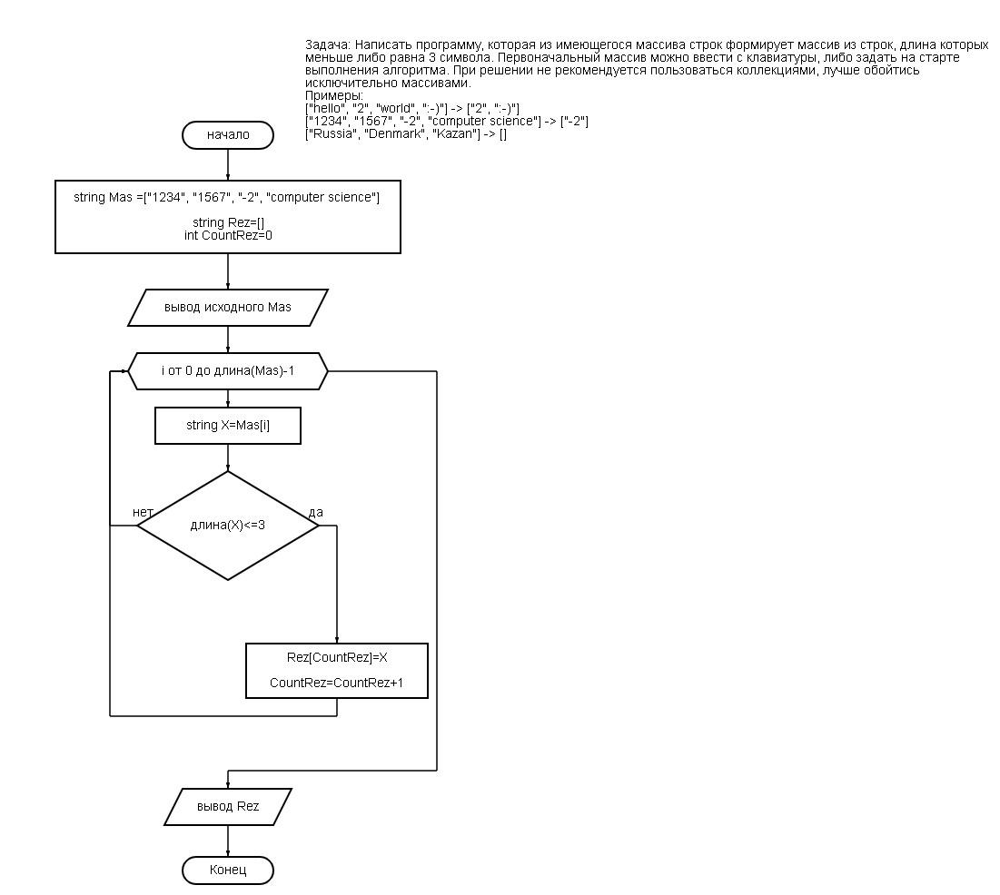
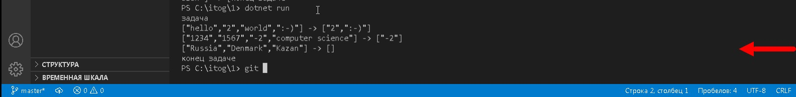
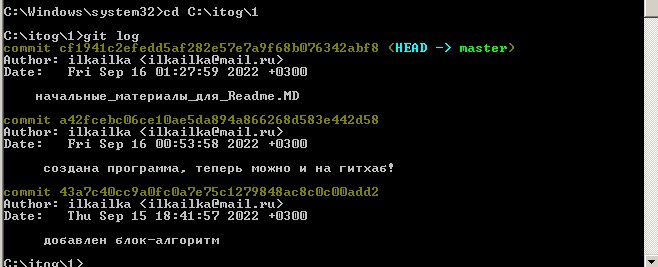

**Итоговая проверочная работа.**

<u>План реадме</u>

1) Постановка задачи
2) Методы решения
3) Применяемые алгоритмы
4) Полученный результат
5) Заключение

<u>***1**   Итак читаем , что дано...*</u>

/*

Данная работа необходима для проверки ваших знаний и навыков по итогу прохождения первого блока обучения на программе разработчик. Мы должны убедиться что базовое знакомство с it прошло успешно.
Задача алгоритмически не самая сложная, однако для полноценного выполнения проверочной работы необходимо:

1. Создать репозиторий на GitHub
2. Нарисовать блок-схему алгоритма (можно обойтись блок-схемой основной содержательной части, если вы
выделяете ее в отдельный метод)
3. Снабдить репозиторий оформленным текстовым описанием решения (файл README.md)
4. Написать программу, решающую поставленную задачу
5. Использовать контроль версий в работе над этим небольшим проектом (не должно быть так что все залито одним коммитом, как минимум этапы 2, 3 и 4 должны быть расположены в разных коммитах)
**Задача:** Написать программу, которая из имеющегося массива строк формирует массив из строк, длина которых меньше либо равна 3 символа. Первоначальный массив можно ввести с клавиатуры, либо задать на старте выполнения алгоритма. При решении не рекомендуется пользоваться коллекциями, лучше обойтись исключительно массивами.

**Примеры:**

["hello", "2", "world", ":-)"] -> ["2", ":-)"]

["1234", "1567", "-2", "computer science"] -> ["-2"]

["Russia", "Denmark", "Kazan"] -> []

*/

2) В общем виде решаем по стандартному плану

- вникаем в условия задачи, т.е. вдумываемся в суть...
- составляем алгоритм, который решает поставленную задачу
- по алгоритму составляем программу...
- анализируем полученный результат и ...
- приходим к выводу, что задача по заданию решена и показывает, что алгоритм имеет право жить
- заключение 

3. составляем алгоритм или блок-схему, которая показывает основной способ решения задачи

   

4. теперь код на с# или сама программа по алгоритму с модернизацией ввода разных тестовых данных, которые никак не влияют на основное тело алгоритма

   /*Задача: Написать программу, которая из имеющегося массива
    строк формирует массив из строк, длина которых
   меньше либо равна 3 символа. Первоначальный массив 
   можно ввести с клавиатуры, либо задать на старте
   выполнения алгоритма. При решении не рекомендуется 
   пользоваться коллекциями, лучше обойтись исключительно массивами.

Примеры:

["hello", "2", "world", ":-)"] -> ["2", ":-)"]

["1234", "1567", "-2", "computer science"] -> ["-2"]

["Russia", "Denmark", "Kazan"] -> [] */

   ```
   string [] VVodPrimerov(int t) // тупой способ охватить кучу примеров
   {string [] rez;
       switch (t)
       {
        case   0: rez=new string[] {"hello", "2", "world", ":-)"};break;
        case   1: rez=new string[] {"1234", "1567", "-2", "computer science"};break;
        case   2: rez=new string[] {"Russia", "Denmark", "Kazan"};break;
        default: rez=new string[] {};break;
       }
       return rez;
   }
   void PrintMas(string [] mas)
   {   if (mas.GetLength(0)==0)
           return;
       Console.Write("[\"");
       for (int i = 0; i < mas.GetLength(0)-1; i++)
           Console.Write($"{mas[i]}\",\"");
       Console.Write($"{mas[mas.GetLength(0)-1]}\"] -> [");
   }
   {string [] masiv;
       Console.Write("задача \n");
       for (int i = 0; i < 3; i++)// количество примеров можно менять
       {
           masiv=VVodPrimerov(i);//ввод исходных примеров
           if (masiv.GetLength(0)==0)
               continue;
           PrintMas(masiv);
           int count=0;
           string [] rezmas = new string[masiv.GetLength(0)];
           for (int x = 0; x < masiv.GetLength(0); x++)
               if (masiv[x].Length<=3)
                   rezmas[count++]=masiv[x];// это заносим в массив)))
           for (int x = 0; x < count; x++)
               Console.Write($"\"{rezmas[x]}\"{((x<count-1)?",":"")}");
           Console.WriteLine("]");
       }
   Console.WriteLine("конец задаче");
   }
   ```

   

5. по полученным скриншотам видно, что программа работает согласно поставленной задаче

   

6. после проверки результатов можно опубликовать и сам этот документ, как есть, на гитхабе

   и заодно проверить понимание работы <u>**Git**</u>

   

**Заключение**

Вот так благодаря GB и учебе там можно чуточку приблизиться к совершенству...


